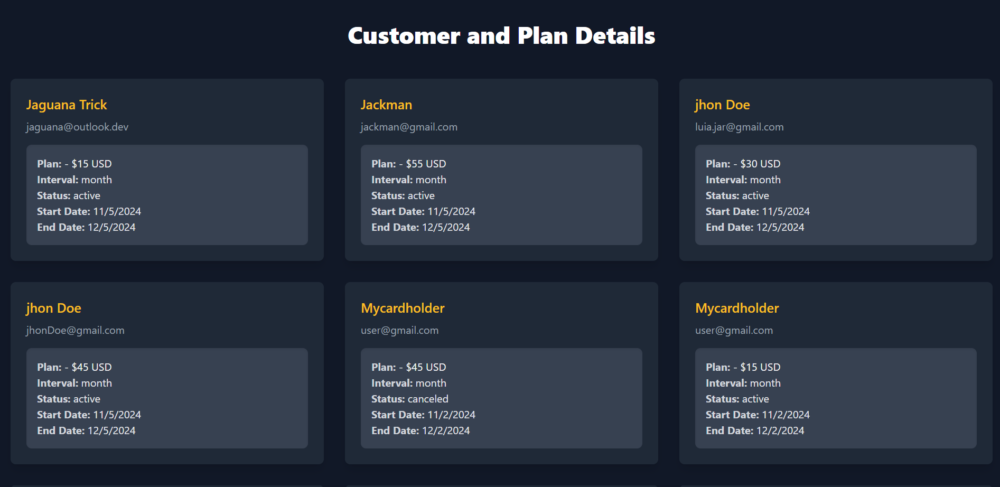

# Subscription Management System with Stripe


# This project is a simple subscription service built using Express.js and Stripe's payment processing API. It allows users to view available subscription plans, subscribe to services, and manage their subscriptions.

Node.js
npm
A Stripe account with active subscription products and plans.
Getting Started
1. Clone the Repository
bash
Copy code
git clone https://github.com/NP5555/stripe_subscriptions_with_nodejs
cd stripe-subscriptions-nodejs
2. Install Dependencies
bash
Copy code
npm install
3. Set Up Environment Variables
Create a .env file in the root of the project with the following variables:

- List all available subscription plans and their prices.
- Create a subscription session and redirect users to Stripe Checkout.

# Retrieve and display customers along with their subscription details.



- Validate coupon codes for discounted subscriptions.
- Handle webhook events from Stripe for subscription management.

## Tech Stack

- Node.js
- Express.js
- Stripe API
- EJS (for rendering views)
- dotenv (for environment variable management)

## Prerequisites

Make sure you have the following installed:

- [Node.js](https://nodejs.org/)
- A Stripe account (to get your API keys)

## Getting Started

1. **Clone the repository**

   ```bash
   git clone https://github.com/NP5555/stripe_subscriptions_with_nodejs
   cd stripe-subscription-service
   ```

2. **Install dependencies**

   ```bash
   npm install
   ```

3. **Set up environment variables**

   Create a `.env` file in the root directory of the project and add your Stripe API keys and other relevant information:

   ```plaintext
   STRIPE_SECRET_KEY=your_stripe_secret_key
   STRIPE_WEBHOOK_SECRET_KEY=your_stripe_webhook_secret
   BASE_URL=http://localhost:3000
   ```

4. **Run the application**

   ```bash
   npm start
   ```

   The server will start on `http://localhost:3000`.

## API Endpoints

- `GET /`: Returns the main home page.
- `GET /get-price/:productId`: Get price details for a specific product by ID.
- `GET /api/get-all-prices`: List all active prices from Stripe.
- `GET /subscribe`: Redirects to Stripe Checkout for subscribing to a plan.
- `GET /success`: Success page after subscription.
- `GET /cancel`: Redirect back to home page if the subscription is canceled.
- `GET /api/get-all-customers`: Retrieve IDs of all customers from Stripe.
- `GET /customers`: Display all customers and their subscription details in a page.
- `POST /webhook`: Endpoint for handling webhook events from Stripe.
- `POST /validate-coupon`: Validate a coupon code.

## Webhook Handling

This application listens for Stripe webhook events such as:
- `checkout.session.completed`
- `invoice.paid`
- `invoice.payment_failed`
- `customer.subscription.updated`

You will need to configure your Stripe account to send webhook events to `/webhook`.

## License

This project is licensed under the MIT License.

## Acknowledgments

- [Stripe](https://stripe.com/docs) for their payment processing API.
- [Express.js](https://expressjs.com/) for their web framework.
- [EJS](https://ejs.co/) for server-side templating.

Feel free to modify, fork, or contribute to the project!
